## Simple testing framework using RobotFramework, SeleniumLibrary, HTTP RequestsLibrary and AppiumLibrary

- [Introduction](#introduction)
- [Pre-Requisites](#pre-requisites)
- [Instructions](#instructions)
    + [IDE](#ide)
    + [Base Project](#base-project)
    + [Project Configuration](#project-configuration)
    + [Appium Android Configuration](#appium-android-configuration)
- [How to launch Test Suites](#how-to-launch-test-suites)
- [Appendix](#appendix)

### Introduction

- Simple testing framework using opensource technologies like [RobotFramework](https://robotframework.org/), [SeleniumLibrary](https://robotframework.org/SeleniumLibrary/SeleniumLibrary.html), [HTTP RequestsLibrary](https://marketsquare.github.io/robotframework-requests/doc/RequestsLibrary.html) and [AppiumLibrary](https://serhatbolsu.github.io/robotframework-appiumlibrary/AppiumLibrary.html).
- The tests are developed using KDB (Keyword Driven Behavior).
- Python based, can be executed in any operating system
- Expanded functionality with [Zoomba Library](https://github.com/Accruent/robotframework-zoomba)
  - [Api Library](https://accruent.github.io/robotframework-zoomba/APILibraryDocumentation.html)
  - [Web Library](https://accruent.github.io/robotframework-zoomba/GUILibraryDocumentation.html)
  - [Mobile Library](https://accruent.github.io/robotframework-zoomba/MobileLibraryDocumentation.html)
- Enhanced debugging with [RobotFramework DebugLibrary](https://github.com/xyb/robotframework-debuglibrary), step-by-step debug from the CLI and can be used as an interactive shell(REPL).
- Excel data approach, you can set the suites to run and variables to use in a excel file.

### Pre-Requisites

- IntelliJ 2021.3 -> ` choco install intellijidea-community `
- Python 3.10 -> ` choco install python3 `
- Node v17.3 -> ` choco install nodejs `
- Android Studio 2020.3 -> ` choco install androidstudio `
- Java JDK 8 -> ` choco install jdk8 `
- Chromedriver -> ` choco install chromedriver `
- Make -> ` choco install make `

### Instructions

#### IDE

- Install the following extensions.
    - [Robot Framework Language Server](https://plugins.jetbrains.com/plugin/16086-robot-framework-language-server)
    - [Python Community Edition](https://plugins.jetbrains.com/plugin/7322-python-community-edition)
    - [Requirements](https://plugins.jetbrains.com/plugin/10837-requirements)
    - (Optional) [TabNine](https://plugins.jetbrains.com/plugin/12798-tabnine-ai-code-completion-js-java-python-ts-rust-go-php--more)

#### Base Project

- Clone the repo:
    - Option A: Use your prefered git gui
    - Option B: Use embedded IntelliJ/PyCharm git interface
    - Option C:
    
    ` git clone -b master --single-branch https://github.com/anxoportela/robotFramework.git saveFolder `

- Open an administrator system terminal on the project root and install the required python packages:

    ` pip install -r requirements.txt `

- Reboot your system

#### Project Configuration

 - Open ` File -> Project Structure ` and select ` Python 3.10 ` as SDK
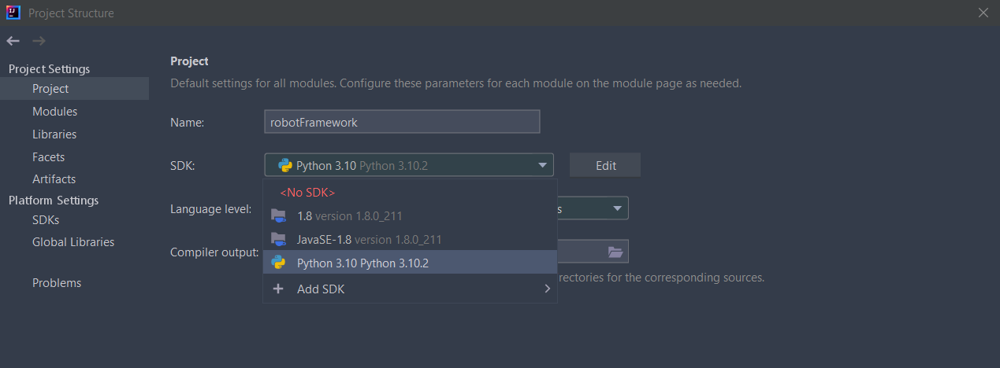
 - Select the interpreter
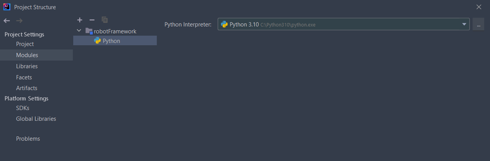 
 - Check that classpath was loaded correctly
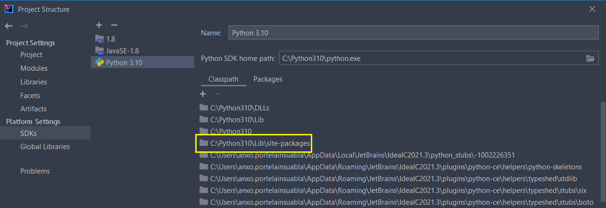
 - Maybe some reload needed between actions

#### Appium Android Configuration

 - Download and install the [Appium Desktop Application](https://github.com/appium/appium-desktop/releases/latest)
 - Open Android Studio and create a new project. The basic one is enough, it's only to install the required dependencies.
 - When all downloads are done, open AVD (Android Virtual Device Manager)
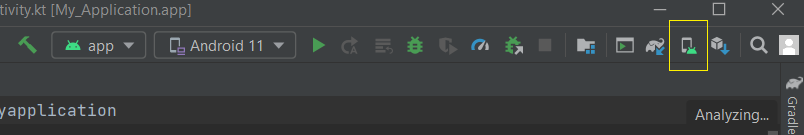
 - Click on create a new virtual device
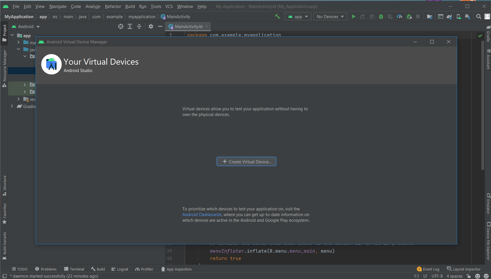
 - Choose the __Pixel 4 XL__
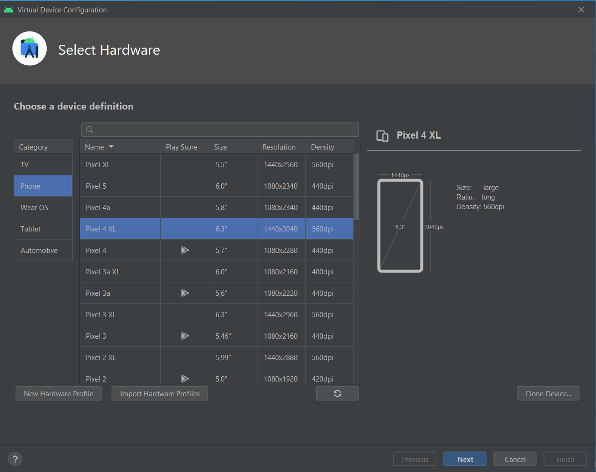
 - Click on the __x86 Images__ tab and download __Android 11__

 - Name the new virtual machine __Android 11__, and finish the installation.
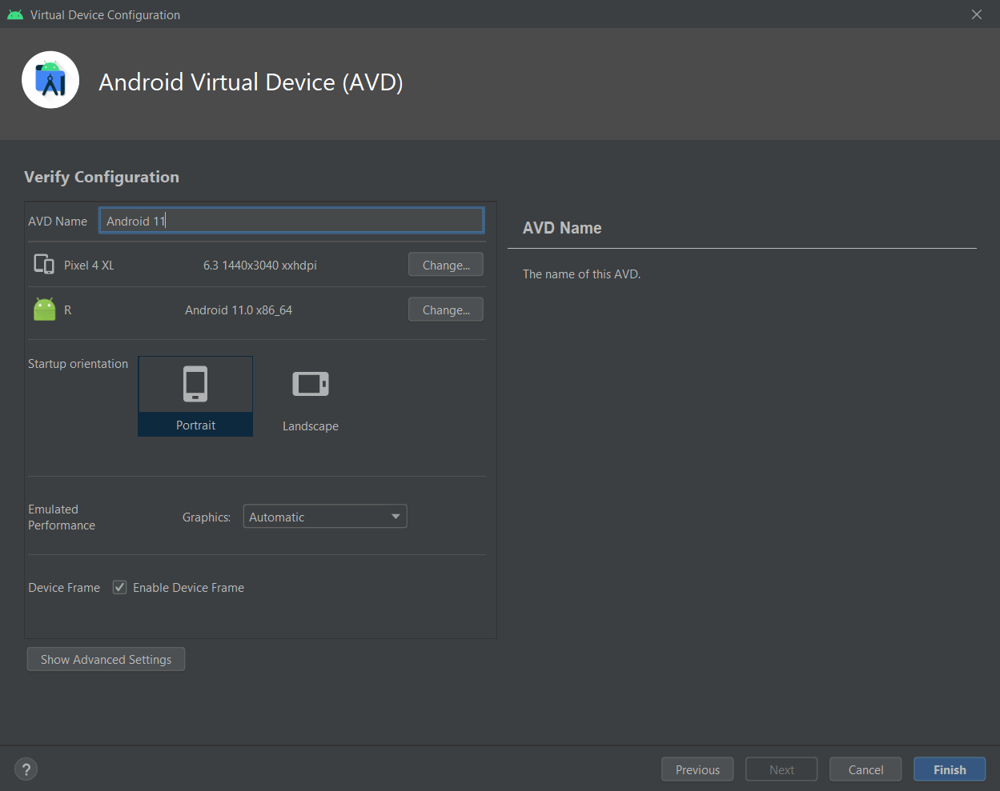
 - Open the environment variables editor and add ` ANDROID_HOME ` as a new system variable. Change your path accordingly.

 - Edit your system path to add a series of variables.
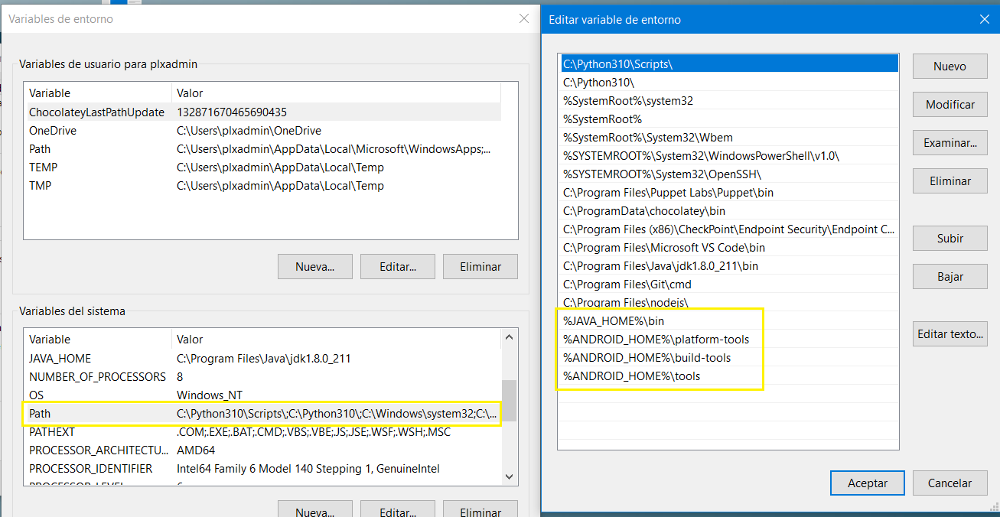
 - Reboot your system
 - Now you can open the Appium application and start the server.
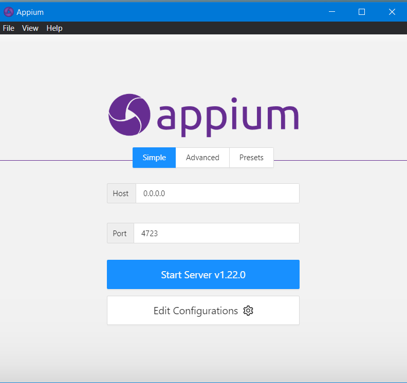
 - And open Android Studio again and start the virtual machine.

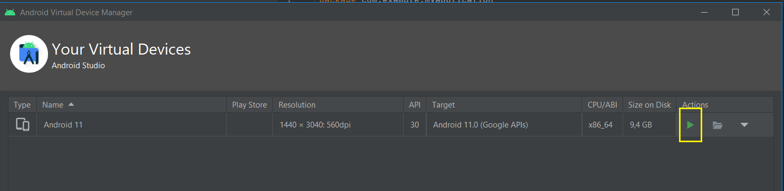
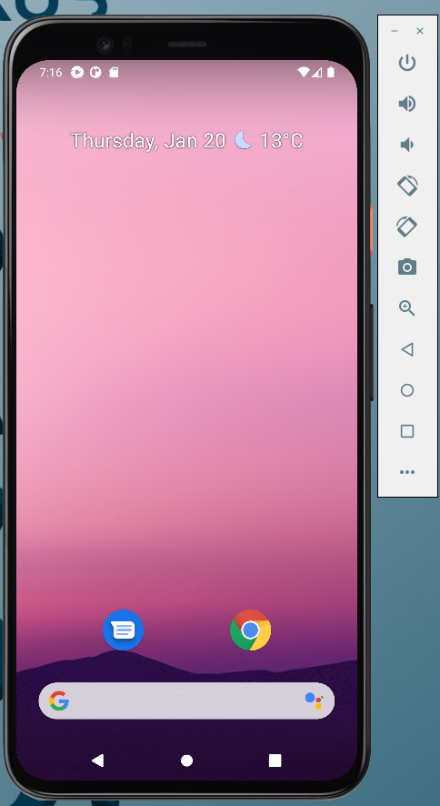
 - Once the device it's open you can close Android Studio and every tool related to it.

### How to launch Test Suites

- Open the excel file on ` resources/testing.xlsx ` , write the name of the ` *.robot ` testcase and set the ` Run ` variable to ` Y ` or ` N `  

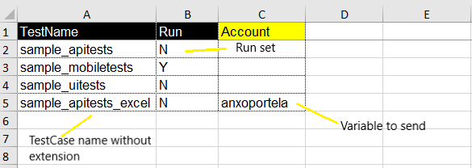
- To run the suite and clean the report's folder, both on local and jenkins, make use of the provided makefile.
    - Run Test Suites: ` make test `
    - Clean Project: ` make clean `
- Results can be found on the results/[date] folder.

### Appendix

 - Create a desktop shortcut to only open the virtual device
   - Go to your user directory ` AppData\Local\Android\Sdk\emulator ` and make a shortcut of ` emulator ` and paste it on your desktop
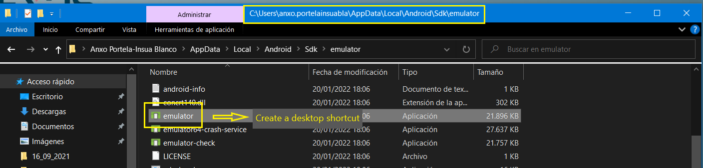
   - Edit the shortcut copied above
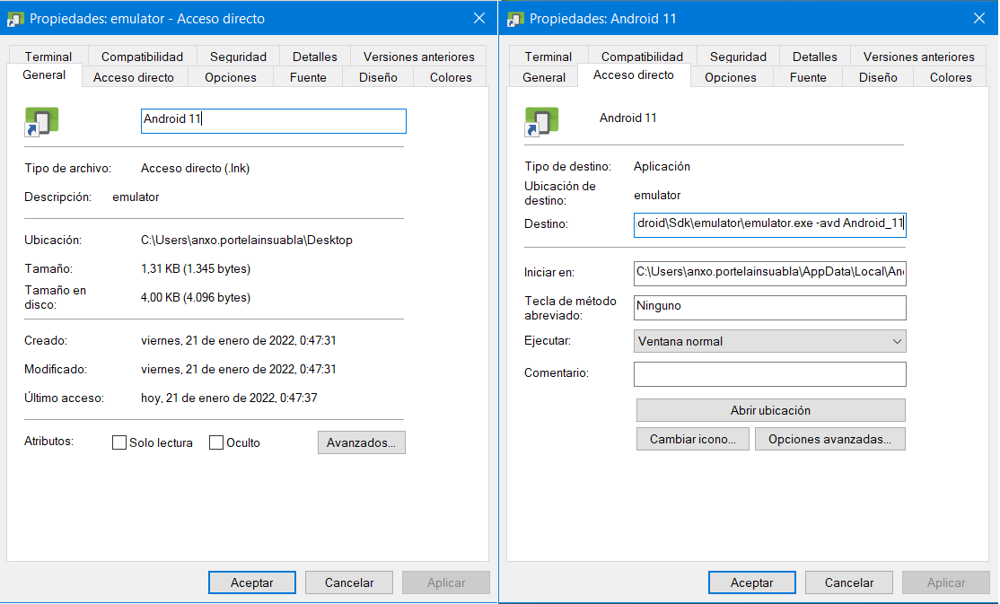

